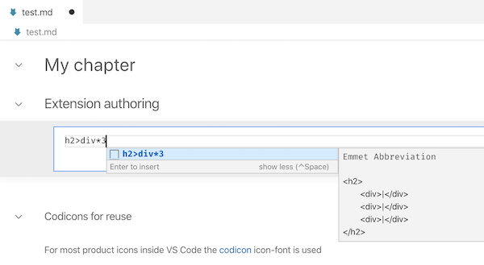

## Intro

This document is about language support for notebooks in VS Code. Notebooks consists of markdown and code cells. This guide is about code cells and focuses on language features, like IntelliSense or Reference Search. 

## Basics

A notebook document consits of different cells and each cell is associated with a text document (`vscode.NotebookCell#document`). Cell documents are ordinary text documents (`vscode.TextDocument`) and are visible and accessible to other extensions. Also, cells that are being edited have an assicated text editor (`vscode.TextEditor`) which again is visible and accessiblie to other extensions. 

This design has the advantage that many extensions just work. For instance, popular extensions like VIM or bracket colorizers work without knowing that they operate on a notebook cell. Also simple language extensions, like Emmet (see capture bolow), work without any tweaks. 



## Notebooks define context

The previous section showed how notebook cells are ordinary documents and how that enables existing extensions for notebooks. This section is about more complex language features, esp. those that operate across "files", like reference search, rename, or diagnostics. 

A requirement of cross-file features is to know on what files to operate, e.g. reference search must know in what files it should search. Various solutions to define such context exists and it depends on the programming language and tooling. Samples are project files like `csharp.proj`, explicit references like triple-slash-references, or using the underlying file system structure. Notebooks should be considered to be another case for defining context, e.g. reference search triggered inside a code cell should consider all notebook cells as its search context. 

The code snippet below is an implementation of text based reference search for notebooks. It will search for the current word in all notebook cells and return that as references. Note how the provider registers for all languages (`*`) but narrows down on the `vscode-notebook-cell`-scheme. That denotes cell documents and requests are always made against a cell from which the notebook/context is derived, similar to deriving a TypeScript project from a file path. 

```ts
// text-based reference search

const selector = { 
	scheme: 'vscode-notebook-cell', // only notebook cells
	language: '*' 
};
vscode.languages.registerReferenceProvider(selector, new class implements vscode.ReferenceProvider {

		provideReferences(document: vscode.TextDocument, position: vscode.Position) {
			// (1) check for search word
			const range = document.getWordRangeAtPosition(position);
			const word = range && document.getText(range);
			if (!word) {
				return undefined;
			}
			// (2) get notebook for the cell-document (TODO: vscode must have simple API for this)
			const notebook = vscode.notebook.notebookDocuments.find(notebook => notebook.cells.find(cell => cell.document === document))!;
			const result: vscode.Location[] = [];
			// (3) search for word in all cells
			for (let cell of notebook.cells) {
				for (let range of this._findAll(word, cell.document)) {
					result.push(new vscode.Location(cell.uri, range))
				}
			}
			return result;
		}

		// all ranges at which word occurres
		private * _findAll(word: string, document: vscode.TextDocument) {
			const text = document.getText();
			let idx = 0;
			while ((idx = text.indexOf(word, idx)) > 0) {
				const start = document.positionAt(idx);
				const end = start.with({ character: start.character + word.length });
				yield new vscode.Range(start, end);
				idx += word.length
			}
		}
	}
)
```

```plaintext
// notebook cells are "virtual" only part of a file on disk, not disc-addressable
// onDidOpen|CloseNotebook to manage (project) state
// selector per notebook { scheme: 'vscode-notebook-cell', language: '*', pattern: 'somenotebook.file' }
```

### Eclusive Features

// html-vue

## concat helper doc

// sample massage results etc pp
